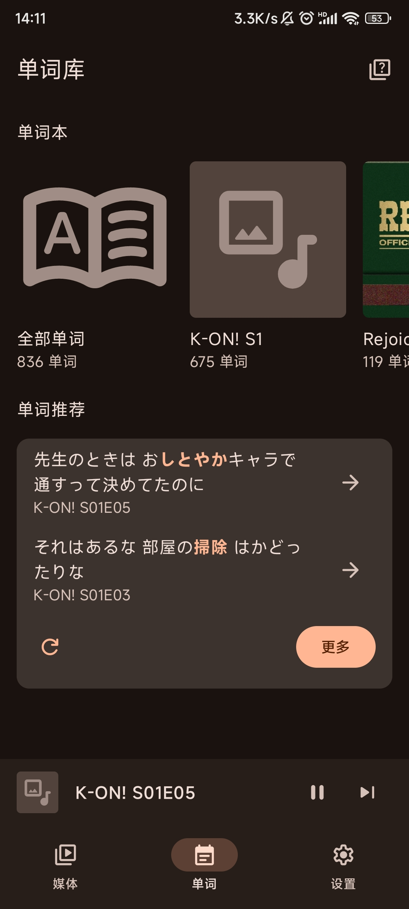
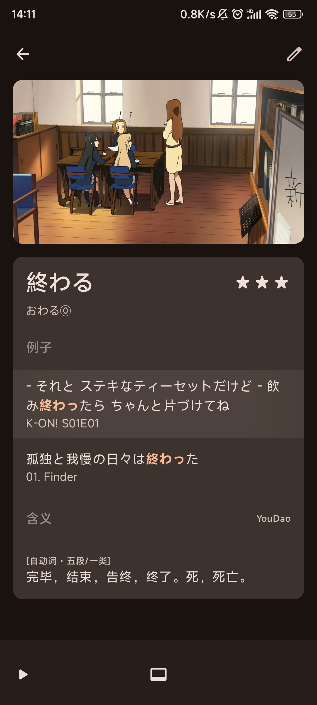

SituLearner是综合影视字幕或音乐歌词的android单词学习软件，
它提供了英语单词或日语单词的情景化记忆手段。

## 使用

### 前提

- 设备：Android设备，且Android版本至少为12。

- 语言：仅支持英语和日语。

- 资源：仅支持本地的影视和音乐资源。

### 下载

[下载链接](https://github.com/coda251/situlearner/releases/latest)。

### 导入资源

1. 在本地存储目录`Movies/`下添加视频合集，`Music/`下添加音乐合集，合集以文件夹的形式储存。
   - 文件夹下为所有媒体文件和字幕文件，字幕文件与对应的媒体文件应当同名。
   - 支持常见的媒体格式（.mp3，.wav，.flac，.mp4，.mkv）和字幕格式（.ass，.srt，.lrc）。android 11开始限制了对外部存储的访问，此时即使申请访问外部存储的权限`android.permission.READ_EXTERNAL_STORAGE`也无法读取到.ass文件，因此app目前需要获取完全的外部存储管理权限。

2. 在app中`媒体`模块添加对应的媒体合集。单个文件大约花费1s的解析时间。

### 添加与回顾单词

1. 在`播放器`界面点击对应的单词，收藏即可。字幕经过分词，单词也已还原至原形。但是目前仅支持查询分词后的结果，不支持自定义选择单词。单词释义取自网络，因此查询释义需要正常的网络连接。另外：双击对应字幕的空白区域可循环播放该例句；长按对应字幕的空白区域可复制该例句的原文。

2. `单词`界面，提供了不同媒体组对应的所有单词，同时根据掌握熟练度为用户推荐需要学习的单词。
3. `单词详情`页面，点击某一个例句即可循环播放该例句的界面。
4. `单词测验`界面，依据anki SM-2算法的简化版本，从单词库中挑选部分单词进行测验。

## 开发

软件采用AGPL-3.0开源协议。开发中部分细节见`doc/dev.md`。我并非专业的软件开发者，欢迎指出代码中存在的不当或错误的地方:)

## 致谢

- [now in android](https://github.com/android/nowinandroid)：提供了应用开发的框架示例。SituLearner的代码架构很大程度上依赖于此。
- [ViMusic](https://github.com/vfsfitvnm/ViMusic)：SituLearner中SeekBar参考了此开源程序。
- [google fonts](https://fonts.google.com/icons)：SituLearner的所有矢量图标均源自于此。
- app中涉及的其它开源库